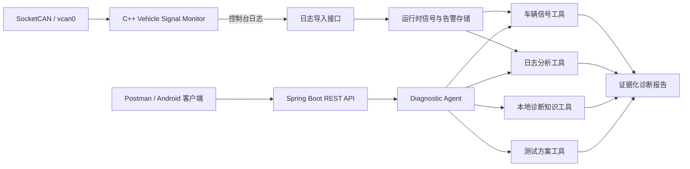

# CockpitDiag Agent

面向智能座舱软件测试与故障定位场景的证据驱动诊断 Agent。它复用本仓库的
C++17/SocketCAN 监控日志，按请求编排车辆信号检查、日志分析、本地知识检索和
测试方案生成工具，输出可追溯证据、风险等级和置信度。

该项目默认使用确定性规则，不依赖外部大模型和 API Key，便于在离线面试环境
稳定演示。它不是车辆控制器：不会发送控制命令，也不会自动清除故障码或复位
ECU。

## 架构



## Agent 行为

1. 每次诊断都检查最新车辆信号；没有数据时明确返回证据不足。
2. 仅在存在监控日志时调用日志分析工具，并按“同类告警最后状态”判断是否已恢复。
3. 根据实际故障码检索对应知识条目，不返回无关排查建议。
4. 当请求包含“测试/test”或 `includeTestPlan=true` 时生成边界与恢复测试。
5. CRITICAL 报告将 `controlActionApprovalRequired` 标记为 `true`，但系统本身不执行控制动作。

## 环境

- JDK 21
- Maven 3.6.3+
- Spring Boot 4.1.1

## 构建与测试

```bash
cd cockpit-diag-agent
mvn clean verify
mvn spring-boot:run
```

健康检查：

```bash
curl http://localhost:8080/actuator/health
```

## 快速演示

服务启动后，在 Windows PowerShell 运行：

```powershell
.\scripts\demo.ps1
```

Linux/macOS 可运行：

```bash
chmod +x scripts/demo.sh
./scripts/demo.sh
```

## 接入 C++ 监控日志

先保存 C++ 监控器输出：

```bash
./build/vehicle_signal_monitor --interface vcan0 --duration 10 | tee runtime/monitor.log
```

再把原始日志导入 Agent：

```bash
curl -X POST -H 'Content-Type: text/plain' \
  --data-binary @runtime/monitor.log \
  http://localhost:8080/api/v1/monitor-log
```

请求诊断：

```bash
curl -X POST -H 'Content-Type: application/json' \
  -d '{"question":"分析当前故障并生成测试计划","includeTestPlan":true}' \
  http://localhost:8080/api/v1/diagnoses
```

也可以直接导入仓库内的示例日志：

```bash
curl -X POST -H 'Content-Type: text/plain' \
  --data-binary @examples/overheat-log.txt \
  http://localhost:8080/api/v1/monitor-log
```

## REST API

| 方法 | 路径 | 用途 |
|---|---|---|
| `POST` | `/api/v1/signals` | 上报一帧车速、温度、挡位和可选时间戳 |
| `POST` | `/api/v1/monitor-log` | 导入 C++ 监控器的原始文本日志 |
| `POST` | `/api/v1/diagnoses` | 编排诊断工具并生成报告 |
| `GET` | `/api/v1/status` | 查看数据是否就绪 |
| `GET` | `/actuator/health` | 服务健康检查 |

## 测试覆盖

- 无数据时拒绝猜测。
- 正常、超温、超时、非法挡位/车速信号。
- C++ 信号与告警日志解析。
- 告警激活后恢复的状态折叠。
- REST 接口导入、诊断、安全确认标记和参数校验。

## 当前边界

- 数据保存在内存中，服务重启后清空。
- 本地知识库为学习项目的最小内容，不等同于整车厂维修手册。
- 当前自定义 `0x100` 协议不等同于量产 DBC；未实现 UDS、QNX、AUTOSAR。
- Android Studio 可用于后续编写显示报告的客户端，但本版本未宣称已实现 Android 应用。
